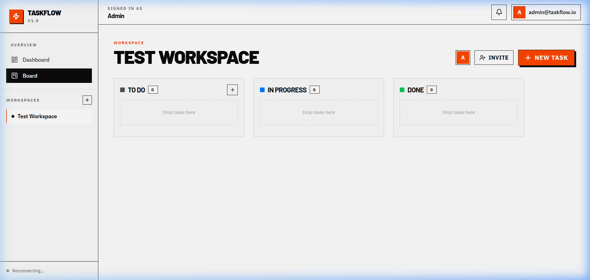
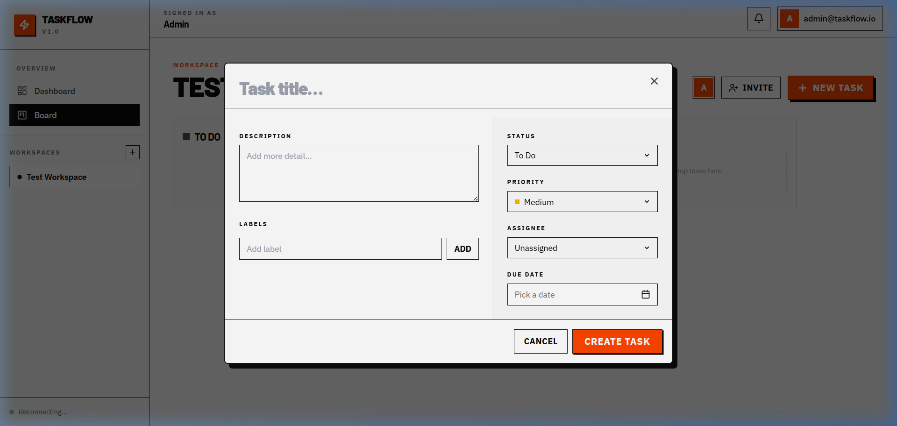

<p align="center">
  
  
  
  
  
</p>

<h1 align="center">⚡ TASKFLOW</h1>

<p align="center">
  <strong>A real-time collaborative Kanban board for modern teams</strong><br/>
  <em>Built with a brutalist UI aesthetic — bold borders, hard shadows, and zero fluff.</em>
</p>

---

## 📸 Screenshots

<p align="center">
  
  <br/><em>Kanban Board — Drag-and-drop task management with real-time sync</em>
</p>

<p align="center">
  
  <br/><em>Task Creation Modal — Status, priority, assignee, due date & labels</em>
</p>

---

## ✨ Features

| Category | Details |
|----------|---------|
| 🗂️ **Kanban Board** | Drag-and-drop tasks across To Do → In Progress → Done columns |
| 👥 **Workspaces** | Create multiple workspaces, invite team members by email |
| 📋 **Task Management** | Title, description, status, priority (Low/Medium/High/Urgent), labels, due dates, assignees |
| 🔄 **Real-time Sync** | WebSocket-powered live updates — see changes as teammates make them |
| 🔐 **Authentication** | JWT-based auth with bcrypt password hashing, 7-day access tokens |
| 🎨 **Brutalist Design** | Bold neo-brutalist UI with hard shadows, sharp borders, and a striking orange accent |
| 📱 **Responsive** | Fully responsive layout that works on desktop and mobile |
| 💬 **Comments** | Add comments to tasks for team discussion |
| 📊 **Dashboard** | Overview of all workspaces with task counts and quick navigation |

---

## 🛠️ Tech Stack

### Frontend
- **React 18** — Component-based UI with hooks
- **Tailwind CSS 3.4** — Utility-first styling with custom brutalist theme
- **React Router v6** — Client-side routing with protected routes
- **WebSocket** — Real-time bidirectional communication
- **date-fns** — Lightweight date manipulation
- **Lucide React** — Beautiful SVG icon library

### Backend
- **FastAPI** — High-performance async Python API framework
- **Motor** — Async MongoDB driver for Python
- **MongoDB Atlas** — Cloud-hosted NoSQL database
- **PyJWT + bcrypt** — Secure authentication
- **WebSocket** — Native FastAPI WebSocket support

---

## 📁 Project Structure

```
TASKFLOW/
├── 📄 README.md
├── 📄 .gitignore
│
├── 🔧 backend/
│   ├── server.py              # FastAPI app — all routes, models, WebSocket manager
│   ├── requirements.txt       # Python dependencies
│   ├── .env.example           # Environment variable template
│   └── .venv/                 # Python virtual environment (git-ignored)
│
└── 🎨 frontend/
    ├── package.json            # Node dependencies & scripts
    ├── tailwind.config.js      # Tailwind theme — brutalist design tokens
    ├── craco.config.js         # CRA override for path aliases (@/)
    ├── postcss.config.js       # PostCSS configuration
    │
    ├── public/
    │   └── index.html          # HTML entry point
    │
    └── src/
        ├── App.js              # Root component — routing & providers
        ├── App.css             # Additional global styles
        ├── index.js            # React DOM entry point
        ├── index.css           # Tailwind base + brutalist design system
        │
        ├── pages/
        │   ├── AuthPage.js     # Login & registration page
        │   ├── DashboardPage.js # Workspace overview dashboard
        │   └── BoardPage.js    # Kanban board with drag-and-drop
        │
        ├── components/
        │   ├── AppShell.js     # Layout wrapper — sidebar + topbar
        │   ├── TaskModal.js    # Task create/edit modal
        │   └── ui/
        │       ├── calendar.jsx    # Custom date picker with month navigation
        │       ├── dialog.jsx      # Modal dialog with backdrop
        │       ├── dropdown-menu.jsx # Context menu component
        │       ├── popover.jsx     # Portal-based popover (escapes overflow)
        │       ├── select.jsx      # Custom select with checkmarks
        │       └── sonner.jsx      # Toast notification wrapper
        │
        ├── contexts/
        │   ├── AuthContext.js      # JWT auth state management
        │   └── RealtimeContext.js  # WebSocket connection & event handling
        │
        ├── lib/
        │   ├── api.js          # HTTP client with auth interceptors
        │   └── utils.js        # Tailwind class merge utility (cn)
        │
        └── constants/
            └── testIds/        # Data-testid constants for E2E testing
                ├── index.js
                ├── app.js
                ├── auth.js
                └── home.js
```

---

## 🚀 Getting Started

### Prerequisites

- **Node.js** ≥ 18
- **Python** ≥ 3.10
- **MongoDB Atlas** account (or local MongoDB instance)

### 1. Clone the repository

```bash
git clone https://github.com/vanshraj07/TASKFLOW.git
cd TASKFLOW
```

### 2. Set up the backend

```bash
cd backend

# Create virtual environment
python -m venv .venv

# Activate it
# Windows:
.venv\Scripts\activate
# macOS/Linux:
source .venv/bin/activate

# Install dependencies
pip install -r requirements.txt

# Configure environment variables
cp .env.example .env
# Edit .env with your MongoDB URI and JWT secret
```

**Required `.env` variables:**

```env
MONGO_URL=mongodb+srv://<user>:<password>@<cluster>.mongodb.net/
DB_NAME=taskflow
JWT_SECRET=your-secret-key-here
```

### 3. Set up the frontend

```bash
cd frontend

# Install dependencies
npm install

# Configure environment variables
cp .env.example .env
# Edit .env if your backend runs on a different port
```

### 4. Run the app

**Start the backend** (from `backend/` directory):
```bash
uvicorn server:app --reload --port 8001
```

**Start the frontend** (from `frontend/` directory):
```bash
npm start
```

The app will be available at **http://localhost:3000**

---

## 🔌 API Endpoints

### Authentication
| Method | Endpoint | Description |
|--------|----------|-------------|
| `POST` | `/api/auth/register` | Create a new account |
| `POST` | `/api/auth/login` | Login and receive JWT |
| `GET` | `/api/auth/me` | Get current user profile |

### Workspaces
| Method | Endpoint | Description |
|--------|----------|-------------|
| `POST` | `/api/workspaces` | Create a workspace |
| `GET` | `/api/workspaces` | List user's workspaces |
| `GET` | `/api/workspaces/:id` | Get workspace details |
| `POST` | `/api/workspaces/:id/invite` | Invite member by email |

### Tasks
| Method | Endpoint | Description |
|--------|----------|-------------|
| `POST` | `/api/tasks` | Create a task |
| `GET` | `/api/tasks?workspace_id=` | List tasks in a workspace |
| `PATCH` | `/api/tasks/:id` | Update a task |
| `DELETE` | `/api/tasks/:id` | Delete a task |

### Comments
| Method | Endpoint | Description |
|--------|----------|-------------|
| `POST` | `/api/tasks/:id/comments` | Add a comment |
| `GET` | `/api/tasks/:id/comments` | List task comments |

### Real-time
| Protocol | Endpoint | Description |
|----------|----------|-------------|
| `WS` | `/ws?token=` | WebSocket for live updates |

---

## 🎨 Design System

TaskFlow uses a **neo-brutalist** design language:

- **Typography** — `Space Grotesk` (display) + `Inter` (body) from Google Fonts
- **Primary Color** — `#FF4500` (International Orange)
- **Shadows** — Hard offset shadows (`4px 4px 0 0 #0A0A0A`)
- **Borders** — Solid 2px black borders with no border-radius
- **Background** — Clean white (`#FDFDFD`) with subtle gray accents

---

## 📝 License

This project is open source and available under the [MIT License](LICENSE).

---

<p align="center">
  <strong>Built with ❤️ by <a href="https://github.com/vanshraj07">Vansh Raj Singh</a></strong>
</p>
